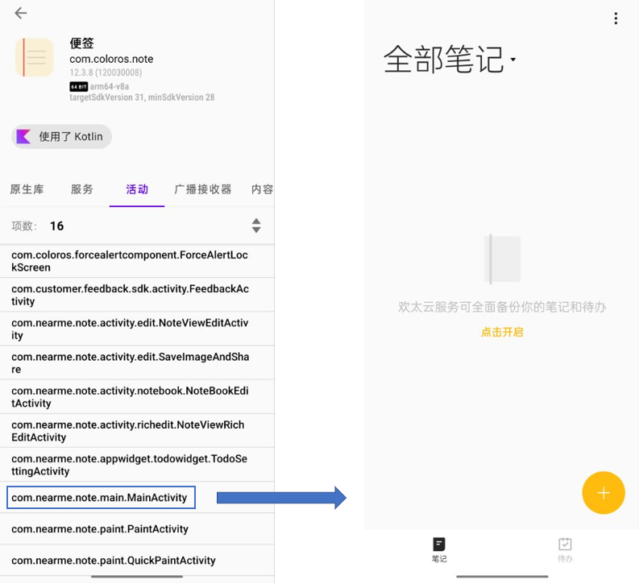

<div align=center>

</div>
<div STYLE="page-break-after: always;"></div>

<br/>
<br/>
<br/>
<br/>
<br/>
<br/>
<br/>
<br/>
<br/>
<br/>
<br/>

# <center>修订记录
<br/>
<br/>

<style>
table {
margin: auto;
}
</style>

| 日期 | 版本 | 描述 | 作者 | 审查 |
| :---: | :---: | :------: | :---: | :---: |
|2022/06/08| v1.0 | 文档初稿 | 李红禧 | 凌明 |

<div STYLE="page-break-after: always;"></div>

# DynamoRIO获取手机应用Trace v1.0
<font color = gray> 由于本人水平的限制，教程中难免存在一些名词使用错误 </font>

### 设备要求

一部已经获得root权限的安卓手机。本文档所采用的手机为OPPO Find X5 Pro，系统为Android12。

## 1、源码修改

在将DynamoRIO成功运行在Android后，此时还无法获得理想的trace的文件。DynamoRIO编译后在Android平台运行动态链接的程序时存在问题，无法获取完整的trace并且输出文件中的trace格式及内容也与我们最终要用的不匹配。因此对源码做了修改。
将原本源码中的<font color = scarlet>dynamorio/api/samples/instrace_simple.c</font>文件替换为附件中的instrace_simple.c即可。主要做了如下更改


```bash
1. 目前在Android平台上，在clean_call()中调用syscall存在bug，因此无法在应用程序的运行过程中将trace信息写入文件中，通过heap的方式暂存trace信息，待程序运行完成之后再写入文件。
2. 增加了对指令机器码的记录
3. 增加了对访存指令的地址的记录
```

instrace_simple的执行过程如下 

```bash
1. 首先执行dr_client_main()，为主函数，负责功能的初始化

2. 接下来每个线程通过event_thread_init()单独初始化私有部分，开辟heap以及生成文件标识符
   # 在此处增加了对指令PC、机器码以及访存指令的访存地址的heap空间的开辟

3. DynamoRIO是通过动态插装来跟踪trace，因此在应用程序执行之前DynamoRIO会完整扫描并获取应用程序的静态指令，每获取一条指令便执行event_app_instruction()，用于解析该条指令的内容
   # 在此处跟新了对指令机器码的解析instrument_instr()，增加了对访存指令的地址的解析instrument_mem()

4. 应用程序正式执行，每运行完一个Basic Block便调用clean_call()来记录应用程序动态执行的指令信息
   # 在此处增加了对指令PC、机器码以及访存指令的访存地址的记录，保存到之前开辟的heap空间

5. 程序运行结束，执行event_thread_exit()退出线程，销毁heap、关闭文件等
   # 在此处增加了dump_trace()函数用于将heap中的数据保存到文件中，写入之后销毁heap。

6. DynamoRIO退出，执行event_exit()，关闭各个组件。
```


替换完文件之后，按照**运行DynamoRIO于安卓平台**文档第一节的**编译**部分，重新编译DynamoRIO并push到手机上。 

<div STYLE="page-break-after: always;"></div>

## 2、手机运行测试
以64位程序为例，在adb shell中进入到<font color = scarlet>/data/local/tmp/DynamoRIO</font>目录下

```bash
$ adb shell
$ cd /data/local/tmp/DynamoRIO
$ export CLASSPATH=/system/framework/am.jar
```

以便签为例
<div align=center>

</div>
通过调用Dynamorio/api/bin/<font color = scarlet>libinstrace.so</font>来获取该活动的trace，在<font color = scarlet>api/bin/</font>中生成trace文件，如下图所示。

```bash
$ bin64/drrun -c api/bin/libinstrace.so -- app_process64 /system/bin com.android.commands.am.Am start -n com.coloros.note/com.nearme.note.main.MainActivity
```

<div STYLE="page-break-after: always;"></div>

<div align=center>

</div>
其中主线程生成的trace文件高达9个G。将文件pull下来。

```bash
$ adb pull /data/local/tmp/Dynamorio/api/bin/instrace.app_process64.13842.0000.log ~/Desktop
```

trace内容格式如下，由PC、机器码以及访存指令的访存地址构成，如下图所示。
<div align=center>

</div>
