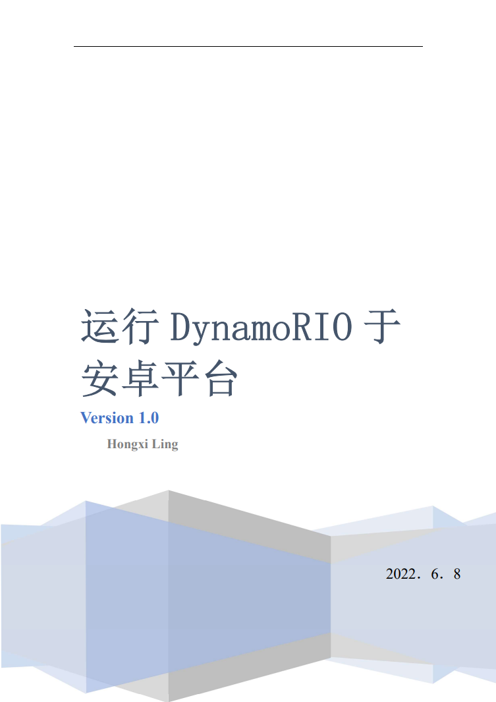
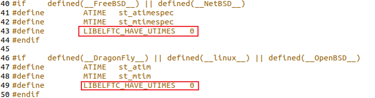
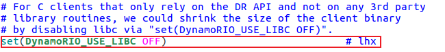
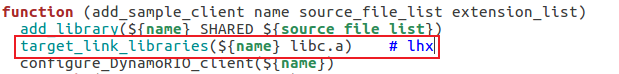
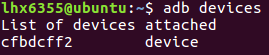
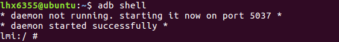
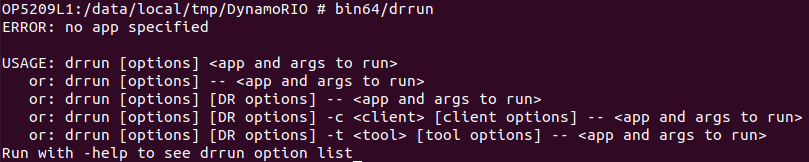
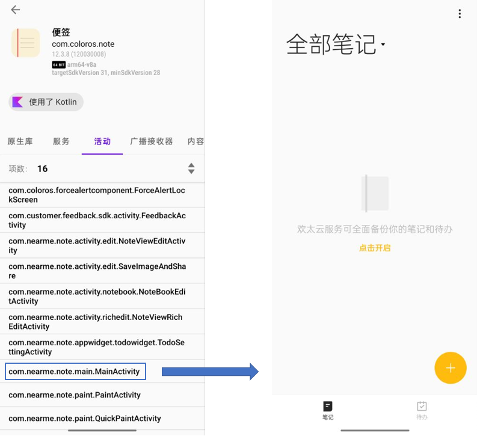
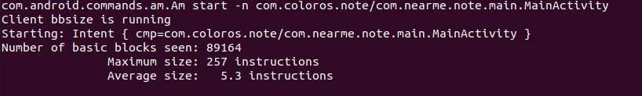

<div align=center>

</div>
<div STYLE="page-break-after: always;"></div>

<br/>
<br/>
<br/>
<br/>
<br/>
<br/>
<br/>
<br/>
<br/>
<br/>
<br/>

# <center>修订记录
<br/>
<br/>

<style>
table {
margin: auto;
}
</style>

| 日期 | 版本 | 描述 | 作者 | 审查 |
| :---: | :---: | :------: | :---: | :---: |
|2022/06/08| v1.0 | 文档初稿 | 李红禧 | 凌明 |


<div STYLE="page-break-after: always;"></div>

# 运行DynamoRIO于安卓平台 v1.0
<font color = gray> 由于本人水平的限制，教程中难免存在一些名词使用错误 </font>

### 设备要求
一部已经获得root权限的安卓手机。本文档所采用的手机为OPPO Find X5 Pro，系统为Android12。

## 1、源码下载及编译
### NDK下载
按照[官网](https://dynamorio.org/page_building.html#autotoc_md85)给出的教程进行源码的获取及编译。
首先下载ndk，并配置它为android独立工具链。这里需要下载r14b版本的ndk来构建DynamoRIO

```bash
# 主目录
$ mkdir bench

$ wget https://dl.google.com/android/repository/android-ndk-r14b-linux-x86_64.zip

$ unzip android-ndk-r14b-linux-x86_64.zip
# 64bit toolchain
$ android-ndk-r14b/build/tools/make-standalone-toolchain.sh --arch=arm64 --platform=android-21 --install-dir=/mytooldir/android-ndk-21-64 --toolchain=aarch64-linux-android-4.9
# 32bit toolchain
$ android-ndk-r14b/build/tools/make-standalone-toolchain.sh --arch=arm --platform=android-21 --install-dir=/mytooldir/android-ndk-21 --toolchain=arm-linux-androideabi-4.9
```

创建软连接

```bash
# 64bit
$ ln -sf aarch64-linux-android-ld.bfd /mytooldir/android-ndk-21-64/bin/aarch64-linux-android-ld
$ ln -sf ld.bfd /mytooldir/android-ndk-21-64/aarch64-linux-android/bin/ld
# 32bit
$ ln -sf arm-linux-androideabi-ld.bfd /mytooldir/android-ndk-21/bin/arm-linux-androideabi-ld
$ ln -sf ld.bfd /mytooldir/android-ndk-21/arm-linux-androideabi/bin/ld
```

<div STYLE="page-break-after: always;"></div>


### 源码下载
接下来[下载](https://github.com/DynamoRIO/dynamorio/releases/tag/release_8.0.0-1)DynamoRIO的源代码，这里下载8.0版本的，并解压到bench目录下，重命名为dynamorio。

为了使DynamoRIO运行在Android，对DynamoRIO的源代码进行[修改](https://github.com/DynamoRIO/dynamorio/pull/3547/commits)。修改完之后在<font color = scarlet>ext/drsyms/libelftc-android-aarch64</font>文件夹下任然缺少文件。接下来按照<font color = scarlet>ext/drsyms/libelftc-aarch64/HOWTOBUILD</font>文件中的方式对缺少的文件进行编译。由于目标为安卓平台，对其进行修改，完整内容如下：

```bash
Install required packages:
$ sudo apt-get install bison build-essential flex libarchive-dev m4 pmake zlib1g-dev
$ sudo apt-get install lsb-release subversion

Check out the sources.
$ mkdir elftoolchain && cd elftoolchain/
$ svn co -r 3530 svn://svn.code.sf.net/p/elftoolchain/code/trunk "${elftc_dir}"

Now build:
$ export CC=/mytooldir/android-ndk-21-64/bin/aarch64-linux-android-gcc
$ export LD=/mytooldir/android-ndk-21-64/bin/aarch64-linux-android-ld
$ export AR=/mytooldir/android-ndk-21-64/bin/aarch64-linux-android-ar
$ export RANLIB=/mytooldir/android-ndk-21-64/bin/aarch64-linux-android-ranlib
$ cd common
$ cp /PATH/TO/DYNAMORIO/ext/drsyms/libelftc-aarch64/native-elf-format.h native-elf-format.h
$ cd ../libelf
$ pmake clean
$ REDIR="-Dmalloc=__wrap_malloc -Dcalloc=__wrap_calloc -Drealloc=__wrap_realloc -Dfree=__wrap_free -Dstrdup=__wrap_strdup -Wno-stringop-truncation"
$ CFLAGS="-O2 -g -fPIC ${REDIR}" pmake libelf.a
$ cd ../libdwarf
$ pmake clean
$ CFLAGS="-O2 -g -fPIC ${REDIR}" pmake libdwarf.a
$ cd ../libelftc
$ pmake clean
$ REDIR="-Dmalloc=__wrap_malloc -Dcalloc=__wrap_calloc -Drealloc=__wrap_realloc -Dfree=__wrap_free -Dstrdup=__wrap_strdup"
```

在最后编译libelftc之前需要更改<font color = scarlet>libelftc/elftc_set_timestamps.c</font>文件，将宏定义LIBELFTC_HAVE_UTIMES改为0
<div align=center>

</div>

<div STYLE="page-break-after: always;"></div>

### 编译文件

```bash
$ CFLAGS="-O2 -g -fPIC ${REDIR}" pmake libelftc.a

Then copy the resulting libelf.a, libelftc.a, and libdwarf.a into the
DynamoRIO source tree at ext/drsyms/libelftc-android-aarch64/lib64/.
Then copy the native-elf-format.h into the
DynamoRIO source tree at ext/drsyms/libelftc-android-aarch64/.
```

由于C库的问题，DynamoRIO提供的API文件并不能直接在安卓设备上直接运行，接下来需要对client的编译文件进行修改，将动态链接C库改为静态链接。

```bash
$ gedit dynamorio/api/samples/CMakeLists.txt
```

在源文件的126行附近，添加如下代码，不关闭的话安卓手机端会报非法指令的错误
<div align=center>

</div>

在源文件的154行附近，添加如下代码<font color = sapphire>target_link_libraries(${name} libc.a)</font>
<div align=center>

</div>


### 编译
接下来进行编译，在cmake那一行删去了<font color = sapphire>-DDR_COPY_TO_DEVICE=ON</font>选项，因为我们需要使用DyanomRIO提供的api来测试，而脚本中push到手机的文件中没有包含这些，因此需要我们在之后自己push到手机中。

```bash
# 进入主目录
$ cd bench
$ mkdir build_android && cd build_android

# 64 bit     64/32选一个编译
$ cmake -DCMAKE_TOOLCHAIN_FILE=../dynamorio/make/toolchain-android-arm64.cmake -DANDROID_TOOLCHAIN=/mytooldir/android-ndk-21-64 ../dynamorio

# 32 bit
$ cmake -DCMAKE_TOOLCHAIN_FILE=../dynamorio/make/toolchain-android-arm32.cmake -DANDROID_TOOLCHAIN=/mytooldir/android-ndk-21 ../dynamorio

$ make -j
```

<div STYLE="page-break-after: always;"></div>

## 2、连接手机
打开手机的<font color = scarlet>开发者选项</font>

通过USB连接到ubuntu，在终端通过adb命令连接手机

```bash
$ adb start-server
$ adb devices
```

显示电脑已经识别手机设备
<div align=center>

</div>

进入手机终端，成功连接

```bash
$ adb shell
```

<div align=center>

</div>


此时回到Linux上，将make好的DynamoRIO工程push到手机<font color = scarlet>/data/local/tmp</font>路径下，DynamoRIO文件夹会自动创建

```bash
$ adb push build_android/ /data/local/tmp/DynamoRIO
```

## 3、手机运行测试
以64位程序为例，在adb shell中进入到<font color = scarlet>/data/local/tmp/DynamoRIO</font>目录下，运行drrun，测试是否可以单独正常运行。

```bash
$ cd /data/local/tmp/DynamoRIO
$ bin64/drrun
```

<div align=center>

</div>

接下来测试应用程序，在终端中设置环境变量

```bash
$ export CLASSPATH=/system/framework/am.jar
```

这里以便签服务为例，先直接测试是否可以成功启动，接着可以测试在drrun下是否可以正常启动。DynamorRIO命令参数中 “--” 后边跟着的就是要启动的程序

```bash
# 直接启动便签
$ app_process64 /system/bin com.android.commands.am.Am start -n com.coloros.note/com.nearme.note.main.MainActivity
# 在drrun下启动便签
$ bin64/drrun -- app_process64 /system/bin com.android.commands.am.Am start -n com.coloros.note/com.nearme.note.main.MainActivity
```

<div align=center>

</div>

通过调用Dynamorio/api/bin/<font color = scarlet>libbbsize.so</font>来统计Basic Block的大小，结果如下图所示。成功实现了DynamoRIO的功能。<font color = scarlet>api/bin</font>中还有很多其它样例trace工具。

```bash
$ bin64/drrun -c api/bin/libbbsize.so -- app_process64 /system/bin com.android.commands.am.Am start -n com.coloros.note/com.nearme.note.main.MainActivity
```

<div align=center>

</div>

